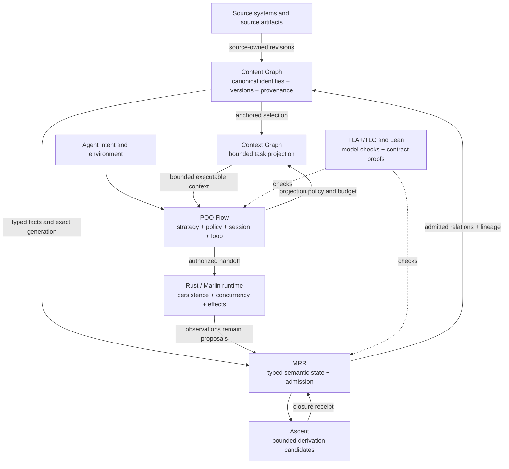

# Meta-Relational Reasoning

The semantic admission layer for POO Flow agent systems.

Meta-Relational Reasoning (MRR) turns proposed facts into bounded, explainable,
identity-bound semantic state changes. It is designed to be composed by
[POO Flow](https://github.com/tao3k/poo-flow), not to replace its Agent control
plane.

## Why this exists

An Agent system can select a strategy, call a model, run a parser, query a
graph, and invoke tools. None of those operations makes their output true.

A proposed fact can still be unsafe to publish when:

- evaluation stopped at a budget and returned only a prefix;
- the proposal was derived from a stale semantic generation;
- evidence is missing or no longer valid;
- fact or derivation identities collide;
- its lineage does not justify the conclusion;
- the resulting state transition violates an invariant.

MRR closes this gap between *a component produced an answer* and *the system may
admit that answer as authoritative state*. Unknown and incomplete remain typed
outcomes; they are never silently converted to false or success.

## Content is not context

The **Content Graph** is the system's single canonical semantic standard: the
source-bound representation of what the system knows. It gives documents,
facts, entities, relations, revisions, and
provenance stable identities so that humans and agents can navigate the same
evidence. "Canonical" does not require one physical database: many source
systems may participate, but each admitted fact has one declared authority,
version, and derivation path.

The **Context Graph** is a task-local projection of that Content Graph. It
selects and orders only the evidence, instructions, tools, memory, policy, and
capabilities needed by one Agent for one bounded decision. It is disposable and
may be compacted; it is never a second source of truth.

| | Content Graph | Context Graph |
| --- | --- | --- |
| Scope | durable, shared, versioned | Agent-, task-, turn-, and capability-scoped |
| Purpose | human cognition, shared sensemaking, reuse, audit | focus the next decision within a finite attention budget |
| Authority | source identity, revision, provenance, admitted derivation | a projection receipt anchored to exact Content generations |
| Change | source-owned revision or admitted semantic transition | select, rank, redact, compact, expire, or rebuild |
| Failure rule | conflicts and unknowns remain explicit | stale, unauthorized, or unanchored nodes fail closed |

This distinction is the foundation for Context Engineering. Every Context node
must resolve to an exact Content identity and generation; every derived edge
must retain its query/rule and MRR admission receipt. A source revision,
permission change, or expired observation invalidates the affected projection.
Agent output returns as a proposal and cannot write itself into the Content
Graph without the owning source and MRR admission path.

Graph structure helps with global sensemaking, but it does not make generated
claims true. Microsoft's
[GraphRAG research](https://www.microsoft.com/en-us/research/publication/from-local-to-global-a-graph-rag-approach-to-query-focused-summarization/)
reports better comprehensiveness and diversity for corpus-wide questions;
[W3C PROV](https://www.w3.org/TR/prov-primer/) supplies the stricter provenance
lesson that revisions, derivations, activities, and responsible agents need
distinct identities. MRR is the assurance boundary between those useful graph
projections and authoritative semantic state.

## Where MRR fits



[POO Flow](https://github.com/tao3k/poo-flow) owns composition, policy objects,
profiles, sessions, loops, resource ordering, retry policy, and runtime handoff.
MRR owns identity, relations, rules, semantic lineage, generations,
transitions, bounded safety, and admission. The runtime owns durable execution
and external effects.

No layer may manufacture another layer's receipt. The complete boundary is
specified in
[POO Flow and MRR Agent Assurance](docs/architecture/0025-poo-flow-mrr-agent-assurance.org).

## The admission contract

MRR materializes a closure only when all of these conditions hold:

1. A validated bundle supplies typed relations, rules, evidence, and an exact
   input generation.
2. Ascent computes bounded candidates and a deterministic closure receipt. It
   does not allocate canonical identities or publish facts.
3. The caller supplies exactly one unique `FactId` and `DerivationId` for every
   sorted candidate.
4. The canonical lineage owner accepts every derivation.
5. The transition owner accepts the complete immutable generation delta.

Only then does the public facade return the transition, derivations, and
identity-complete receipt together. A truncated closure, stale generation,
identity mismatch, invalid lineage, or invalid transition returns an error and
materializes nothing.

The executable owner is
[`admission.rs`](crates/meta-relational-reasoning/src/admission.rs). Truth and
incompleteness projection is owned by
[`truth.rs`](crates/meta-relational-reasoning/src/truth.rs).

## Why these technologies

| Component | Why it is here | What it does not own |
| --- | --- | --- |
| POO Flow and Gerbil POO | Express extensible Agent strategies, policies, resource plans, and proof-facing handoff values | MRR fact truth or durable runtime effects |
| Ascent | Reuse a maintained Rust-native Datalog-style fixed-point engine instead of implementing another closure/join engine | Identity, lineage admission, transitions, publication |
| BYODS research direction | Let Datalog joins use relation-specific Rust data structures when their semantics and performance evidence justify it | A second rule language, a bypass around MRR admission, or an unmeasured optimization claim |
| TLA+ and TLC | Explore finite protocol interleavings and produce counterexamples for transition and composition safety | Runtime execution or an unbounded correctness proof |
| Lean | Kernel-check stated identity, admission, and composition theorems | Runtime conformance or state-space exploration |
| Rust and Marlin | Own concurrency, persistence, checkpoints, subprocesses, and external effects | POO Flow policy facts or MRR semantic receipts |

TLA+ is important at the Agent boundary because delegation, authorization,
revocation, cancellation, retry, checkpoint recovery, and exactly-once effects
are temporal properties. The
[AgentRFC paper](https://arxiv.org/abs/2603.23801) similarly lowers Agent
protocol requirements into typed models, checks TLA+ invariants, and replays
counterexamples against implementations. MRR currently provides finite
transition parity evidence; it does not claim AgentRFC conformance.

Detailed decisions live with their owners:

- [why Ascent is the bounded proposal engine](docs/architecture/0003-mrr-ascent-evaluation.org)
- [why semantic lineage is an admission contract](docs/architecture/0009-unified-lineage-v1.org)
- [why TLA+ and TLC matter for Agent composition](docs/architecture/0021-mrr-differential-oracles.org)
- [the recorded performance baseline](docs/architecture/0022-mrr-performance-baseline.org)

Ascent and
[Bring Your Own Data Structures to Datalog (BYODS)](https://doi.org/10.1145/3622840)
matter for different reasons. Ascent provides the maintained declarative
fixed-point engine used today. BYODS shows how a Datalog engine can preserve
declarative rules while replacing representation-imposed joins with proven
domain data structures such as equivalence relations or lattices. That is the
right future optimization seam for large Content Graph workloads: optimize the
candidate engine and representation, then require the same deterministic MRR
receipt and admission contract. BYODS is research guidance here, not a claimed
current backend.

## What is implemented

- `meta-relational-reasoning` is the stable Rust consumer facade.
- `mrr-identity`, `mrr-relation`, `mrr-query`, and `mrr-logic` own typed
  semantic contracts. `mrr-relation` validates recursive parameterized value
  schemas, nullability, relation constraints, and coherent fact context.
- `mrr-bundle` admits complete reasoning bundles and derives a canonical
  storage-neutral relation catalog;
  `CatalogBoundQuery` binds a query to that catalog and an exact semantic
  source snapshot before downstream execution planning.
- `mrr-ascent` evaluates bounded fixed-point candidates.
- `mrr-lineage` and `mrr-transition` validate causal evidence and immutable
  generation deltas.
- `mrr-revision` admits canonical semantic snapshots that bind one generation
  to an unambiguous set of provider-neutral source revisions.
- `mrr-gerbil` consumes the Gerbil AOT projection through a fixed-width native
  ABI and preserves the upstream typed Gerbil runtime status at failures;
  Scheme is not in the Rust/Ascent query hot path.
- `mrr-frontends` lowers parser-owned ISO GQL artifacts into `MetaQueryIr`
  without a second Rust parser or public GQL AST stack.
- `mrr-conformance` exercises the public facade across multiple domains.
- `experiments/mrr-live` evaluates real model proposals while keeping POO Flow
  scheduling and MRR receipts authoritative.

The Scheme surface already reuses POO Flow object, flow, plan, functional, and
observability APIs. The package declares only `gerbil-parser`; that package owns
the transitive POO Flow revision so MRR does not create a second dependency pin.

GQL and Cypher are adapters, not the identity of this project. The ISO/IEC 39075
profile remains evidence-driven and non-certifying. Rowan is only a lossless
CST sink. SeleneDB, Grafeo, and froGQL remain research references rather than
dependencies or semantic authorities.

## GraphQL, GQL, Cypher, and graph roles are different layers

The word "graph" appears in several unrelated interfaces. This repository uses
the following terms precisely:

| Term | Layer | Meaning here |
| --- | --- | --- |
| Property Graph | Data model | Vertices/nodes and directed edges/relationships carrying labels and properties. It is a model, not a query language and not automatically a Content or Context Graph. |
| [ISO GQL](https://www.iso.org/standard/76120.html) | Database language | ISO/IEC 39075:2024 language for defining, querying, and modifying property graphs and graph collections. This is the parser-owned standard targeted by the GQL profile. |
| [Cypher / openCypher](https://opencypher.org/) | Database-language family | Neo4j-originated pattern language and its open specification. openCypher now evolves toward ISO GQL, but a Cypher dialect is not automatically full GQL conformance. |
| [PGQL](https://pgql-lang.org/spec/1.5/) | Database language | Oracle-led SQL-like Property Graph Query Language. PGQL queries property graphs; "Property Graph" and "PGQL" are not synonyms. |
| [SQL/PGQ](https://www.iso.org/standard/79473.html) | SQL extension | ISO/IEC 9075-16 property-graph queries integrated into SQL, including graph pattern matching over graphs exposed from relational data. It is distinct from standalone ISO GQL. |
| [GraphQL](https://graphql.org/) | API language and runtime | A typed API field-selection language independent of any database or storage engine. It is not ISO GQL, Cypher, PGQL, or a graph database language. |
| Content Graph | Architecture role | Canonical source-bound semantic standard with identity, versions, provenance, and admitted derivations. |
| Context Graph | Architecture role | Bounded task projection anchored to an exact Content generation, policy, capability scope, and expiry. |

These layers are separately owned, but they are not semantically arbitrary. A
query language is defined against a data model:

- GQL, Cypher/openCypher, and PGQL express patterns over variants of the
  Property Graph model;
- SQL/PGQ exposes Property Graph patterns inside SQL's relational environment;
- GraphQL selects fields from an API schema and resolver graph, not from a
  Property Graph unless an application explicitly maps it to one.

MRR therefore cannot admit a query merely because its text parsed. A query must
also type-check against the exact graph catalog, property types, direction and
path rules, source snapshot, and semantic generation that will execute it.

Representative graph engines occupy the storage/query layer, not the MRR
admission layer:

| Engine | Published model/language surface | Possible role in this architecture |
| --- | --- | --- |
| [Neo4j](https://neo4j.com/docs/cypher-manual/current/introduction/cypher-overview/) | Property graph database queried with Cypher; current releases document substantial, but not complete, mandatory GQL support | May store canonical Content or derived Context; MRR contracts decide which, not the database brand |
| [Memgraph](https://memgraph.com/blog/cypher-differences-between-neo4j-and-memgraph) | Property graph database with an openCypher-based dialect and extensions | Candidate real-time materialization/query backend, with dialect differences kept outside semantic authority |
| [Kuzu](https://kuzudb.github.io/docs/) | Embedded structured-property-graph database with an openCypher-based Cypher implementation | Candidate embedded analytical store; its schema and query engine do not replace source identity or admission |
| [FalkorDB](https://docs.falkordb.com/) | Property graph database supporting openCypher plus proprietary extensions and GraphRAG facilities | Can implement retrieval or a Context projection, but generated/retrieved edges remain non-authoritative until admitted |
| [Apache AGE](https://age.apache.org/overview/) | PostgreSQL extension implementing openCypher grammar and hybrid SQL/Cypher queries | Can expose relational and graph data together; source ownership remains explicit across both views |
| [Oracle Property Graph](https://pgql-lang.org/) | Property graphs queried through PGQL and, in current Oracle Database, SQL/PGQ integration | Another property-graph query family; it is neither GraphQL nor the ISO GQL profile parsed here |
| [Apache GraphAr](https://github.com/apache/incubator-graphar) | System-independent, chunked Property Graph file format with metadata, column groups, and CSR/CSC/COO-oriented edge layouts | Proposed persistent graph-layout dependency for the separate [`mrr-data`](https://github.com/tao3k/mrr-data) design; no integration is implemented yet |

The same engine may physically hold both graphs, but the identities must not be
collapsed. A Content node is admitted and durable. A Context node is selected,
ranked, possibly summarized, permission-scoped, and replaceable. Database
storage, indexes, traversal algorithms, and query syntax cannot establish that
semantic distinction on their own.

The proposed downstream data plane is canonically specified by
[`mrr-data` RFC 0001](https://github.com/tao3k/mrr-data/blob/main/docs/architecture/0001-mrr-data-plane.org).
This repository keeps only its upstream contract in
[RFC 0026](docs/architecture/0026-mrr-data-graphar.org): `mrr-data` may depend
on MRR's storage-neutral semantic contracts, while MRR must not depend back on
`mrr-data`, Arrow, GraphAr, CID/CAR, IPFS, or a query engine. Both documents are
currently proposals, not implementation claims.

Arrow is the proposed canonical *physical interchange* form, not the semantic
source of truth. GraphAr is a persistent projection for the graph-shaped subset
of MRR relations, not a universal encoding of arbitrary n-ary facts. CID proves
the identity of exact canonical bytes, not `GenerationId`, authority, or
admission; CAR packages blocks but does not define semantic snapshot identity.
Concrete catalog/snapshot binding belongs in a downstream query receipt around
`MetaQueryIr`. Parser and frontend evidence alone is not end-to-end
database-query admission.

## Comparison by responsibility

This is a boundary comparison, not a performance ranking.

| System | Design center | Relationship to MRR |
| --- | --- | --- |
| [Palantir Foundry, Ontology, and AIP](https://www.palantir.com/docs/foundry/architecture-center/overview) | Integrate enterprise data, logic, actions, security, workflows, and AI agents around an operational Ontology | The comparable unit is POO Flow + MRR + Runtime, not MRR alone; MRR covers only typed semantic reasoning and admission |
| [Open Policy Agent](https://www.openpolicyagent.org/docs) | Evaluate policy over structured input and data | Can supply policy decisions; it does not replace MRR derivation lineage and generation admission |
| [Ascent](https://s-arash.github.io/ascent/cc22main-p95-seamless-deductive-inference-via-macros.pdf) and [Souffle](https://github.com/souffle-lang/souffle) | Compute Datalog-style logical results | Ascent is MRR's current candidate engine; MRR adds identity, receipts, lineage, and atomic admission |
| [TLA+ and TLC](https://lamport.azurewebsites.net/pubs/yuanyu-model-checking.pdf) | Specify and check finite state models | Supplies independent transition evidence; it does not publish runtime state |

Palantir also makes the lineage distinction important. Foundry
[Data Lineage](https://www.palantir.com/docs/foundry/data-lineage/overview)
tracks how datasets move through pipelines. MRR lineage instead records why an
admitted result follows from facts, rules, queries, and transitions. POO Flow
and the runtime retain the separate lifecycle, handoff, and effect lineage. A
complete Agent system needs all three; collapsing them into one generic
"provenance" graph would erase their different admission authorities.

## Build and verify

Use the repository environment so Cargo, Gerbil packages, native libraries, and
proof tools resolve through the same dependency graph. The preferred entrypoint
is `just`: its recipes always refresh the Gerbil package through the
SDK-sanitizing `mrr-gerbil` wrapper before Cargo can stage the native archive.

```bash
./.devenv/devenv-profile-exec just test
./.devenv/devenv-profile-exec just check
```

The underlying owner commands remain available for focused diagnosis:

```bash
./.devenv/devenv-profile-exec mrr-gerbil build
./.devenv/devenv-profile-exec mrr-gerbil test
./.devenv/devenv-profile-exec mrr-cargo test --workspace
./.devenv/devenv-profile-exec mrr-cargo test -p mrr-conformance --all-targets
./.devenv/devenv-profile-exec env GQL_HARNESS_VERIFY=1 \
  mrr-cargo check --workspace --all-targets
./.devenv/devenv-profile-exec uv --project proofs/MRRProof run pytest -q \
  proofs/MRRProof/tests
./.devenv/devenv-profile-exec uv --project experiments/mrr-live run pytest -q \
  experiments/mrr-live/tests
```

## Project status

All workspace crates remain on the stable `0.1` release line. The repository is
pre-release research and engineering work. Passing conformance, model-checking,
proof, and benchmark gates is evidence for the implemented contracts; it is not
a claim of full ISO certification, general-purpose reasoning completeness, or
complete AgentRFC conformance.

There are no legacy compatibility modes or alternate admission paths. Provider
output remains observational input and cannot publish facts or replace an MRR
receipt.

`cargo package` remains intentionally disabled while workspace crates retain
local unpublished dependency edges. Packaging will be enabled only after the
publication topology is closed.
