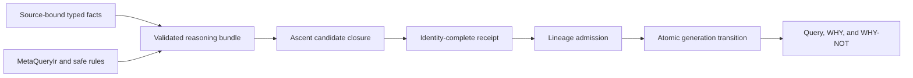

<!--
SPDX-FileCopyrightText: 2026 tao3k team and Contributors

SPDX-License-Identifier: AGPL-3.0-only
-->

# Meta-Relational Reasoning

A typed logic and admission layer for reasoning-grade languages.

MRR turns source-bound facts, relations, and rules into bounded derivations that
can be queried, explained, versioned, and either admitted or rejected as one
semantic state transition. It is the reasoning layer composed by
[POO Flow](https://github.com/tao3k/poo-flow); it is not an Agent runtime or a
graph database.

## Why the name MRR

The name is the architecture in three words.

### Meta

MRR does not reason over bare application values alone. Every fact is qualified
by the metadata that determines whether it may participate in reasoning:

- a stable identity and semantic generation;
- an explicit authority;
- source or derivation provenance;
- evidence completeness;
- validity and invalidation state.

This is what makes the system *meta*: it reasons with the conditions under
which a relation is meaningful and admissible, not merely with an unqualified
edge or row. It does not claim a general higher-order logic.

### Relational

The common semantic unit is a typed, n-ary relation. A software dependency, a
knowledge claim, and a workflow permission can therefore use the same core:

```text
calls(caller, callee)
supports(evidence, claim)
permits(policy, action, resource)
```

A Property Graph edge is one useful binary relation, but it is not the whole
model. Relations may have any validated arity, ordered typed fields,
nullability, constraints, and mandatory context. Entity properties reuse the
same value-schema system rather than introducing a graph-only type universe.

Relations matter because they give queries and rules one compositional
vocabulary. Frontend syntax, storage layout, and execution strategy may change
without changing what a fact means. GQL and Cypher are adapters; Arrow,
GraphAr, a database, or an in-memory index can be downstream representations.
None of them becomes semantic authority merely by storing or parsing a fact.

### Reasoning

MRR is concerned with what follows from admitted facts and rules, why it
follows, why it cannot yet be established, and whether the resulting change is
safe to publish.

For example, the following is conceptual logic notation, not a second MRR
surface syntax:

```text
reaches(x, y) <- calls(x, y)
reaches(x, z) <- calls(x, y), reaches(y, z)
```

The rules describe the relation to derive, rather than an imperative traversal
plan. A fixed-point engine can maintain the resulting closure, while MRR keeps
the engine inside a stricter contract: bounded evaluation, deterministic
receipts, caller-owned identities, admitted lineage, and an atomic generation
transition.

## Why logic programming

Reasoning needs more than retrieval. A query language can find stored facts;
logic programming can also express reusable consequences of those facts.

MRR uses a Datalog-style model because it provides four properties needed by a
reasoning-grade language:

1. **Declarative meaning.** A rule states a logical consequence independently
   of join order, indexes, traversal code, or storage engine.
2. **Compositional inference.** Typed atoms, unification, joins, and safe rules
   let small relations combine into larger conclusions.
3. **A finite semantic boundary.** Safe rules, exact generations, explicit
   budgets, and least-fixed-point evaluation make a run reproducible and
   auditable.
4. **Explanation.** A derived result can retain its supporting facts and rule
   applications. `WHY` projects admitted witnesses; bounded `WHY-NOT` reports
   missing premises or incompleteness instead of guessing that absence means
   false.

MRR is therefore not "just Datalog." Ascent is the maintained Rust-native
candidate engine. MRR adds the contracts a candidate engine does not own:
stable identities, typed relation context, semantic generations, lineage,
truth and incompleteness states, transition validation, and fail-closed
admission.

## What this gives a reasoning-grade language

A reasoning-grade language must distinguish several operations that ordinary
query APIs often collapse:

| Operation | MRR meaning |
| --- | --- |
| Assert | Propose a typed fact under an exact authority and generation |
| Query | Select admitted facts through language-neutral `MetaQueryIr` |
| Derive | Apply safe rules to produce bounded candidate facts |
| Explain | Project `WHY` evidence from admitted lineage |
| Diagnose | Use bounded `WHY-NOT` to expose missing premises or incomplete search |
| Change | Validate a complete immutable generation delta before publication |

This separation prevents three common category errors:

- a parsed query is not yet a semantically valid query;
- a generated or retrieved claim is not yet an admitted fact;
- a missing result is not automatically false.

The public truth model preserves `TRUE`, `FALSE`, `UNKNOWN`, `INCOMPLETE`,
`STALE`, and `CONFLICT` as distinct outcomes. GQL, Cypher, and future relational
frontends lower into the same `MetaQueryIr`; they do not define separate
reasoning semantics.

## From proposal to admitted state



MRR materializes a closure only when:

1. the bundle validates its schemas, facts, rules, entities, properties, and
   exact input generation;
2. bounded evaluation produces a complete deterministic candidate receipt;
3. the caller supplies one unique `FactId` and `DerivationId` for every sorted
   candidate;
4. the lineage owner accepts every derivation; and
5. the transition owner accepts the complete immutable generation delta.

A truncated closure, stale generation, identity mismatch, invalid lineage, or
invalid transition returns an error and materializes nothing.

## System boundary

MRR deliberately has a narrow ownership boundary:

- **POO Flow** owns Agent composition, strategies, policies, sessions, loops,
  resource ordering, and runtime handoff.
- **MRR** owns typed semantic identity, relations, rules, queries, lineage,
  generations, transitions, bounded safety, and admission.
- **gerbil-parser** owns concrete syntax and lossless parser evidence used by
  the GQL and Cypher frontends.
- **Ascent** computes candidate fixed points but cannot publish facts or invent
  MRR identities.
- **Runtime and data systems** own persistence, concurrency, physical layout,
  indexes, and external effects. The downstream `mrr-data` plane implements
  Arrow interchange, local CID/CAR packaging, and a maintained GraphAr native
  projection slice without becoming an MRR dependency. It also executes the
  first admitted single-hop binary-Entity slice through DataFusion over both
  Arrow and GraphAr physical reads; broader query execution remains downstream.

MRR is not GraphQL, a graph database, a storage format, an Agent orchestrator,
or a second parser. A Property Graph is one data model that can be projected
into typed relations; ISO GQL and Cypher are query-language frontends over that
model. GraphQL is a separate API language.

## What is implemented

- `mrr-identity`, `mrr-relation`, `mrr-query`, and `mrr-logic` own the typed
  semantic contracts.
- `mrr-bundle` admits complete reasoning bundles and derives canonical relation
  and entity/property catalogs.
- `CatalogBoundQuery` binds property access to both catalogs and an exact
  semantic source snapshot, statically checks expressions and parameters, and
  publishes an ordered result row schema before execution planning.
- `mrr-ascent` evaluates bounded fixed-point candidates.
- `mrr-lineage` and `mrr-transition` validate causal evidence and immutable
  generation deltas.
- `mrr-revision` binds a generation to an unambiguous set of provider-neutral
  source revisions.
- `mrr-frontends` explicitly selects parser-owned ISO GQL or openCypher AOT
  artifacts and lowers both into the same `MetaQueryIr`, without a second Rust
  parser or public language-specific AST stack.
- `mrr-gerbil` consumes the Gerbil AOT projection through a fixed-width native
  ABI and preserves typed upstream runtime failures.
- `meta-relational-reasoning` is the stable Rust consumer facade; it owns no
  duplicate semantics.
- `mrr-conformance`, Lean proofs, TLA+/TLC models, and differential oracles
  provide independent evidence for their stated contracts.

## Design references

The README defines the project. Detailed arguments and evidence remain with
their owners:

- [workspace and language-neutral ownership](docs/architecture/0001-mrr-workspace-ownership.org)
- [bounded Ascent evaluation](docs/architecture/0003-mrr-ascent-evaluation.org)
- [typed relation core](docs/architecture/0005-typed-relation-core.org)
- [MetaQueryIr](docs/architecture/0006-meta-query-ir.org)
- [unified lineage](docs/architecture/0009-unified-lineage-v1.org)
- [`WHY` explanation](docs/architecture/0010-why-explanation.org)
- [bounded `WHY-NOT` analysis](docs/architecture/0011-why-not-analysis.org)
- [truth and incompleteness](docs/architecture/0023-mrr-truth-and-incompleteness.org)
- [ISO GQL language profile](docs/architecture/0024-iso-gql-language-profile.org)
- [POO Flow and MRR assurance boundary](docs/architecture/0025-poo-flow-mrr-agent-assurance.org)
- [`mrr-data` boundary and implementation gates](docs/architecture/0026-mrr-data-graphar.org)
- [relation-catalog query binding](docs/architecture/0029-relation-catalog-query-binding.org)
- [entity and property catalog](docs/architecture/0030-entity-property-catalog.org)
- [static query typing and result schema](docs/architecture/0031-static-query-typing.org)
- [bounded query-result candidate admission](docs/architecture/0032-query-result-admission.org)

## Build and verify

Use the repository environment so Cargo, Gerbil packages, native libraries,
and proof tools resolve through one dependency graph. `just` refreshes the
Gerbil package through the SDK-sanitizing `mrr-gerbil` wrapper before Cargo can
stage the native archive.

```bash
./.devenv/devenv-profile-exec just test
./.devenv/devenv-profile-exec just check
```

Focused owner commands remain available for diagnosis:

```bash
./.devenv/devenv-profile-exec mrr-gerbil build
./.devenv/devenv-profile-exec mrr-gerbil test
./.devenv/devenv-profile-exec mrr-cargo test --workspace --locked
./.devenv/devenv-profile-exec mrr-cargo test -p mrr-conformance --all-targets
./.devenv/devenv-profile-exec env GQL_HARNESS_VERIFY=1 \
  mrr-cargo check --workspace --all-targets
./.devenv/devenv-profile-exec uv --project proofs/MRRProof run pytest -q \
  proofs/MRRProof/tests
./.devenv/devenv-profile-exec uv --project experiments/mrr-live run pytest -q \
  experiments/mrr-live/tests
```

## Project status

All workspace crates remain on the stable `0.1` release line. The repository is
pre-release research and engineering work. Passing conformance,
model-checking, proof, and benchmark gates is evidence for the implemented
contracts; it is not a claim of full ISO certification, general-purpose logic
completeness, or complete AgentRFC conformance.

There are no legacy compatibility modes or alternate admission paths. Provider
output remains observational input and cannot publish facts or replace an MRR
receipt.

`cargo package` remains intentionally disabled while workspace crates retain
local unpublished dependency edges. Packaging will be enabled only after the
publication topology is closed.

## License

Original MRR work is licensed under `AGPL-3.0-only`.
See [LICENSE](LICENSE) for the terms and
[THIRD_PARTY_NOTICES.md](THIRD_PARTY_NOTICES.md) for reference material.
