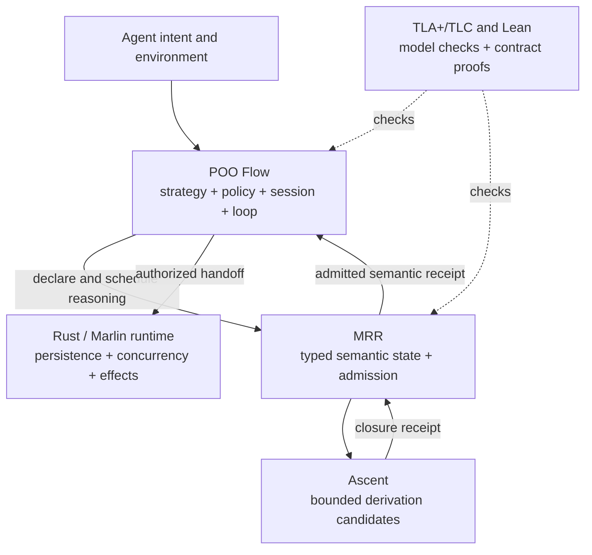

# Meta-Relational Reasoning

The semantic admission layer for POO Flow agent systems.

Meta-Relational Reasoning (MRR) turns proposed facts into bounded, explainable,
identity-bound semantic state changes. It is designed to be composed by
[POO Flow](https://github.com/tao3k/poo-flow), not to replace its Agent control
plane.

## Why this exists

An Agent system can select a strategy, call a model, run a parser, query a
graph, and invoke tools. None of those operations makes their output true.

A proposed fact can still be unsafe to publish when:

- evaluation stopped at a budget and returned only a prefix;
- the proposal was derived from a stale semantic generation;
- evidence is missing or no longer valid;
- fact or derivation identities collide;
- its lineage does not justify the conclusion;
- the resulting state transition violates an invariant.

MRR closes this gap between *a component produced an answer* and *the system may
admit that answer as authoritative state*. Unknown and incomplete remain typed
outcomes; they are never silently converted to false or success.

## Where MRR fits



[POO Flow](https://github.com/tao3k/poo-flow) owns composition, policy objects,
profiles, sessions, loops, resource ordering, retry policy, and runtime handoff.
MRR owns identity, relations, rules, semantic lineage, generations,
transitions, bounded safety, and admission. The runtime owns durable execution
and external effects.

No layer may manufacture another layer's receipt. The complete boundary is
specified in
[POO Flow and MRR Agent Assurance](docs/architecture/0025-poo-flow-mrr-agent-assurance.org).

## The admission contract

MRR materializes a closure only when all of these conditions hold:

1. A validated bundle supplies typed relations, rules, evidence, and an exact
   input generation.
2. Ascent computes bounded candidates and a deterministic closure receipt. It
   does not allocate canonical identities or publish facts.
3. The caller supplies exactly one unique `FactId` and `DerivationId` for every
   sorted candidate.
4. The canonical lineage owner accepts every derivation.
5. The transition owner accepts the complete immutable generation delta.

Only then does the public facade return the transition, derivations, and
identity-complete receipt together. A truncated closure, stale generation,
identity mismatch, invalid lineage, or invalid transition returns an error and
materializes nothing.

The executable owner is
[`admission.rs`](crates/meta-relational-reasoning/src/admission.rs). Truth and
incompleteness projection is owned by
[`truth.rs`](crates/meta-relational-reasoning/src/truth.rs).

## Why these technologies

| Component | Why it is here | What it does not own |
| --- | --- | --- |
| POO Flow and Gerbil POO | Express extensible Agent strategies, policies, resource plans, and proof-facing handoff values | MRR fact truth or durable runtime effects |
| Ascent | Reuse a maintained Rust-native Datalog-style fixed-point engine instead of implementing another closure/join engine | Identity, lineage admission, transitions, publication |
| TLA+ and TLC | Explore finite protocol interleavings and produce counterexamples for transition and composition safety | Runtime execution or an unbounded correctness proof |
| Lean | Kernel-check stated identity, admission, and composition theorems | Runtime conformance or state-space exploration |
| Rust and Marlin | Own concurrency, persistence, checkpoints, subprocesses, and external effects | POO Flow policy facts or MRR semantic receipts |

TLA+ is important at the Agent boundary because delegation, authorization,
revocation, cancellation, retry, checkpoint recovery, and exactly-once effects
are temporal properties. The
[AgentRFC paper](https://arxiv.org/abs/2603.23801) similarly lowers Agent
protocol requirements into typed models, checks TLA+ invariants, and replays
counterexamples against implementations. MRR currently provides finite
transition parity evidence; it does not claim AgentRFC conformance.

Detailed decisions live with their owners:

- [why Ascent is the bounded proposal engine](docs/architecture/0003-mrr-ascent-evaluation.org)
- [why semantic lineage is an admission contract](docs/architecture/0009-unified-lineage-v1.org)
- [why TLA+ and TLC matter for Agent composition](docs/architecture/0021-mrr-differential-oracles.org)
- [the recorded performance baseline](docs/architecture/0022-mrr-performance-baseline.org)

## What is implemented

- `meta-relational-reasoning` is the stable Rust consumer facade.
- `mrr-identity`, `mrr-relation`, `mrr-query`, and `mrr-logic` own typed
  semantic contracts.
- `mrr-bundle` admits complete reasoning bundles.
- `mrr-ascent` evaluates bounded fixed-point candidates.
- `mrr-lineage` and `mrr-transition` validate causal evidence and immutable
  generation deltas.
- `mrr-gerbil` consumes the Gerbil AOT projection through a fixed-width native
  ABI; Scheme is not in the Rust/Ascent query hot path.
- `mrr-frontends` lowers parser-owned ISO GQL artifacts into `MetaQueryIr`
  without a second Rust parser or public GQL AST stack.
- `mrr-conformance` exercises the public facade across multiple domains.
- `experiments/mrr-live` evaluates real model proposals while keeping POO Flow
  scheduling and MRR receipts authoritative.

The Scheme surface already reuses POO Flow object, flow, plan, functional, and
observability APIs. The package declares only `gerbil-parser`; that package owns
the transitive POO Flow revision so MRR does not create a second dependency pin.

GQL and Cypher are adapters, not the identity of this project. The ISO/IEC 39075
profile remains evidence-driven and non-certifying. Rowan is only a lossless
CST sink. SeleneDB, Grafeo, and froGQL remain research references rather than
dependencies or semantic authorities.

## Comparison by responsibility

This is a boundary comparison, not a performance ranking.

| System | Design center | Relationship to MRR |
| --- | --- | --- |
| [Parlant](https://www.parlant.io/docs/quickstart/motivation/) | Select conversational guidelines, journeys, tools, and context before response generation | Can govern the interaction boundary; MRR separately admits derived semantic state |
| [Open Policy Agent](https://www.openpolicyagent.org/docs) | Evaluate policy over structured input and data | Can supply policy decisions; it does not replace MRR derivation lineage and generation admission |
| [Ascent](https://s-arash.github.io/ascent/cc22main-p95-seamless-deductive-inference-via-macros.pdf) and [Souffle](https://github.com/souffle-lang/souffle) | Compute Datalog-style logical results | Ascent is MRR's current candidate engine; MRR adds identity, receipts, lineage, and atomic admission |
| [TLA+ and TLC](https://lamport.azurewebsites.net/pubs/yuanyu-model-checking.pdf) | Specify and check finite state models | Supplies independent transition evidence; it does not publish runtime state |

## Build and verify

Use the repository environment so Cargo, Gerbil packages, native libraries, and
proof tools resolve through the same dependency graph.

```bash
./.devenv/devenv-profile-exec mrr-gerbil build
./.devenv/devenv-profile-exec mrr-gerbil test
./.devenv/devenv-profile-exec mrr-cargo test --workspace
./.devenv/devenv-profile-exec mrr-cargo test -p mrr-conformance --all-targets
./.devenv/devenv-profile-exec env GQL_HARNESS_VERIFY=1 \
  mrr-cargo check --workspace --all-targets
./.devenv/devenv-profile-exec uv --project proofs/MRRProof run pytest -q \
  proofs/MRRProof/tests
./.devenv/devenv-profile-exec uv --project experiments/mrr-live run pytest -q \
  experiments/mrr-live/tests
```

## Project status

All workspace crates remain on the stable `0.1` release line. The repository is
pre-release research and engineering work. Passing conformance, model-checking,
proof, and benchmark gates is evidence for the implemented contracts; it is not
a claim of full ISO certification, general-purpose reasoning completeness, or
complete AgentRFC conformance.

There are no legacy compatibility modes or alternate admission paths. Provider
output remains observational input and cannot publish facts or replace an MRR
receipt.

`cargo package` remains intentionally disabled while workspace crates retain
local unpublished dependency edges. Packaging will be enabled only after the
publication topology is closed.
